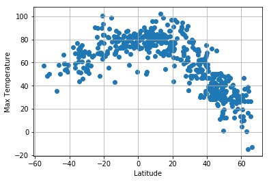
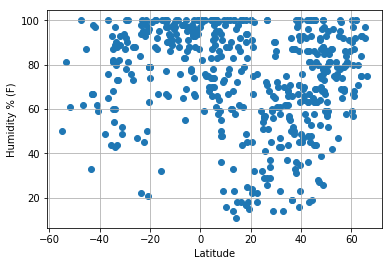
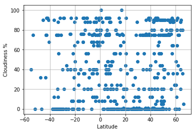
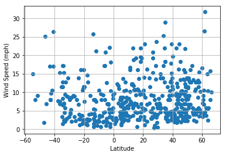

```python
from citipy import citipy
import numpy as np
import random
import requests
import json
import pandas as pd
import matplotlib.pyplot as plt

api_key = YOUR_API_KEY

```


```python
def get_random_cities_weather_info(number_of_cities):
    cities_info = []                                    # Will hold all the cities information
    cities_names = []                                   # Helps us keep track of cities and avoid duplicates
    while (len(cities_names) < num_of_cities):
        # Tells you how far in the process
        if(len(cities_names)%100 == 0):
            print(len(cities_names), "/ 500 completed")
            
        # Getting random latitude and longiutde
        latitude = random.uniform(-82.86, 64.75)
        longitude = random.uniform(-100.11, 147.34)
        city=citipy.nearest_city(latitude, longitude)
        
        # If the city is not a duplicate
        if city not in cities_names:
            query_url = url + "appid=" + api_key + "&q=" + city.city_name + "&units=imperial"
            weather_response = requests.get(query_url)
            city_data = weather_response.json()
            # Only add the city if the request was succesfull 
            try:
                if(city_data["coord"]):
                    cities_info.append(city_data)
                    cities_names.append(city)
                print("City Added: " + city.city_name)
            except:
                print("City was not added: " + city.city_name)
                continue
        # after getting all the data return
    return cities_info

# Uncomment the line below to get new data
# cities_info = get_random_cities_weather_info(500)
```

    0 / 500 completed
    City was not added: taolanaro
    0 / 500 completed
    City Added: faya
    City Added: padang
    City Added: jamestown
    City was not added: tsihombe
    City Added: shenxian
    City Added: baracoa
    City Added: labuhan
    City Added: saint-felicien
    City Added: wewak
    City Added: airai
    City Added: fort myers beach
    City Added: chuy
    City was not added: bengkulu
    City Added: wukari
    City Added: port alfred
    City Added: biltine
    City Added: punta arenas
    City Added: lorengau
    City Added: katsuura
    City was not added: tsihombe
    City was not added: cagayan de tawi-tawi
    City Added: busselton
    City Added: bambous virieux
    City Added: new norfolk
    City Added: bubaque
    City Added: vyborg
    City Added: pangnirtung
    City Added: cayenne
    City Added: tateyama
    City Added: ponta do sol
    City Added: east london
    City Added: zima
    City Added: sao filipe
    City Added: carnarvon
    City Added: bada
    City was not added: taolanaro
    City Added: saint-philippe
    City Added: hobart
    City Added: albany
    City Added: lebu
    City Added: mar del plata
    City Added: salalah
    City Added: bat yam
    City Added: ambon
    City Added: bredasdorp
    City was not added: tsihombe
    City Added: panzhihua
    City Added: osypenko
    City was not added: matatlan
    City Added: ushuaia
    City Added: urucara
    City was not added: stornoway
    City was not added: taolanaro
    City Added: kununurra
    City Added: lethem
    City Added: iwanai
    City Added: caconda
    City Added: garowe
    City Added: rolla
    City Added: salmas
    City Added: bar harbor
    City Added: arraial do cabo
    City Added: georgetown
    City was not added: guelengdeng
    City was not added: taolanaro
    City Added: midrand
    City Added: katiola
    City Added: druzhba
    City Added: kruisfontein
    City Added: laguna
    City Added: santa isabel do rio negro
    City Added: san martin
    City Added: nouadhibou
    City Added: hermanus
    City Added: tagusao
    City Added: tura
    City Added: quatre cocos
    City Added: mosquera
    City Added: puerto ayora
    City Added: johnson city
    City Added: nepomuk
    City Added: souillac
    City Added: torbay
    City Added: nadvoitsy
    City Added: kavaratti
    City Added: marsabit
    City Added: hambantota
    City Added: mutis
    City Added: stolbishche
    City Added: kysyl-syr
    City was not added: sug-aksy
    City Added: karratha
    City Added: marsh harbour
    City Added: thompson
    City Added: nanortalik
    City Added: sao joao da barra
    City Added: dimitrovgrad
    City Added: los llanos de aridane
    City Added: the valley
    City Added: roros
    City Added: sao miguel do araguaia
    City Added: taoudenni
    City Added: richards bay
    City Added: nara
    City Added: davila
    City Added: huancabamba
    City Added: ribeira grande
    City Added: castro
    City Added: poli
    City Added: coquimbo
    City Added: velsk
    City was not added: tapaua
    City Added: codrington
    100 / 500 completed
    City Added: matipo
    City was not added: tsihombe
    City Added: popova
    City was not added: taolanaro
    City Added: mantua
    City was not added: bengkulu
    City Added: nouakchott
    City Added: kapit
    City Added: talara
    City was not added: umzimvubu
    City Added: gat
    City was not added: sorvag
    City Added: rio grande
    City Added: atiquizaya
    City Added: alta floresta
    City Added: swellendam
    City Added: anuradhapura
    City Added: luderitz
    City Added: jiujiang
    City Added: horsham
    City Added: hasaki
    City Added: saldanha
    City Added: iqaluit
    City Added: opuwo
    City Added: victoria
    City Added: fukue
    City was not added: taolanaro
    City Added: kropotkin
    City Added: salinopolis
    City Added: dehui
    City Added: asosa
    City Added: moroni
    City Added: yangambi
    City Added: hofn
    City Added: brokopondo
    City Added: san juan de los morros
    City was not added: attawapiskat
    City was not added: eldikan
    City Added: carroll
    City Added: port blair
    City Added: kushikino
    City Added: cidreira
    City Added: taman
    City was not added: taolanaro
    City Added: pisco
    City Added: itacoatiara
    City Added: saint-georges
    City Added: coihueco
    City was not added: tsihombe
    City was not added: ye
    City Added: bandarbeyla
    City Added: brazzaville
    City Added: harlingen
    City was not added: kismayo
    City Added: tacna
    City Added: emirdag
    City Added: saint anthony
    City Added: jalu
    City Added: lasa
    City Added: maceio
    City Added: artyom
    City Added: ladario
    City Added: victor harbor
    City Added: sapele
    City Added: abha
    City Added: aloleng
    City Added: saraland
    City Added: sao gabriel da cachoeira
    City was not added: longlac
    City Added: marzuq
    City Added: casambalangan
    City Added: mount gambier
    City was not added: taolanaro
    City Added: cape town
    City was not added: duz
    City Added: hithadhoo
    City Added: bathsheba
    City Added: novopokrovka
    City Added: kloulklubed
    City Added: sibolga
    City Added: caravelas
    City Added: xining
    City Added: mahebourg
    City was not added: tsihombe
    City was not added: tsihombe
    City Added: adrar
    City Added: shenjiamen
    City Added: ust-maya
    City was not added: malwan
    City was not added: burica
    City Added: grand gaube
    City was not added: kristiinankaupunki
    City Added: maningrida
    City Added: samarkand
    City Added: alice springs
    City Added: exeter
    City Added: mazara del vallo
    City Added: mangrol
    City Added: vallenar
    City Added: dzaoudzi
    City Added: yining
    City Added: danane
    City Added: san mateo ixtatan
    City Added: port elizabeth
    City Added: esperance
    City Added: haimen
    City Added: phan thiet
    City was not added: taolanaro
    City Added: cap malheureux
    City Added: mae hong son
    City was not added: azimur
    City Added: schopfheim
    City Added: san carlos de bariloche
    City Added: umm lajj
    City Added: la gomera
    City Added: dezhou
    City was not added: svetlyy
    City Added: kabinda
    City Added: teya
    City Added: puerto carreno
    City Added: charters towers
    City Added: saint george
    City Added: tual
    200 / 500 completed
    City Added: peno
    City Added: strezhevoy
    City Added: paamiut
    City Added: bozoum
    City Added: arlit
    City Added: golborne
    City Added: namibe
    City Added: amuntai
    City Added: birjand
    City was not added: crab hill
    City was not added: suzu
    City Added: santa maria
    City Added: puerto madero
    City Added: sainte-marie
    City was not added: taolanaro
    City Added: colomi
    City Added: balkanabat
    City Added: mezhova
    City Added: muli
    City Added: dingle
    City Added: catuday
    City Added: oak ridge
    City was not added: attawapiskat
    City Added: hailar
    City was not added: attawapiskat
    City Added: okhotsk
    City Added: bongandanga
    City was not added: jujuy
    City Added: grand-santi
    City Added: port hedland
    City Added: hernani
    City Added: alyangula
    City Added: kumluca
    City Added: ineu
    City Added: pregradnaya
    City Added: rio gallegos
    City Added: herat
    City Added: vila velha
    City Added: atar
    City Added: portland
    City Added: naftalan
    City Added: concarneau
    City was not added: camana
    City Added: baie-saint-paul
    City Added: deltona
    City Added: destin
    City Added: abu samrah
    City Added: san cristobal
    City was not added: chikoy
    City Added: viedma
    City Added: ambilobe
    City Added: arua
    City Added: hobyo
    City Added: turayf
    City Added: chhoti sadri
    City was not added: taolanaro
    City Added: porto novo
    City was not added: chagda
    City Added: baruun-urt
    City was not added: attawapiskat
    City Added: mecca
    City Added: shepsi
    City Added: itarema
    City Added: visby
    City Added: winneba
    City was not added: bengkulu
    City Added: kholm
    City Added: coruripe
    City Added: mandalgovi
    City Added: broken hill
    City was not added: taolanaro
    City Added: mitsamiouli
    City Added: san
    City Added: denia
    City Added: bosaso
    City Added: awbari
    City Added: santo tomas
    City Added: salaga
    City was not added: palabuhanratu
    City Added: zhicheng
    City Added: vagur
    City Added: balkhash
    City Added: sarkand
    City Added: coihaique
    City Added: tezu
    City Added: bharatpur
    City Added: ishigaki
    City Added: tecozautla
    City was not added: kushmurun
    City Added: pizarro
    City Added: mandurah
    City Added: hamilton
    City Added: meulaboh
    City was not added: haibowan
    City Added: miraflores
    City was not added: kismayo
    City Added: jumla
    City Added: shizunai
    City Added: gibara
    City Added: mkushi
    City Added: emba
    City Added: george
    City Added: lagoa
    City Added: yerbogachen
    City was not added: olafsvik
    City was not added: palabuhanratu
    City Added: bonavista
    City Added: sur
    City Added: thinadhoo
    City Added: pucallpa
    City Added: praia da vitoria
    City Added: bihariganj
    City Added: novikovo
    City Added: trebukhiv
    City Added: hualmay
    City was not added: kachikau
    City was not added: daosa
    City Added: ajnala
    City Added: port huron
    City Added: conceicao do mato dentro
    City was not added: bengkulu
    City Added: maldonado
    300 / 500 completed
    300 / 500 completed
    City was not added: sakakah
    300 / 500 completed
    300 / 500 completed
    City Added: custoias
    City Added: penapolis
    City Added: hrubieszow
    City Added: mocuba
    City Added: teguldet
    City was not added: taolanaro
    City Added: mendoza
    City Added: rumburk
    City Added: gazli
    City Added: republic
    City Added: morros
    City Added: tabuk
    City Added: bulgan
    City Added: pozo colorado
    City Added: calama
    City Added: maniitsoq
    City Added: gao
    City Added: nageshwari
    City Added: mahon
    City was not added: cam pha
    City Added: carutapera
    City Added: pringsewu
    City Added: freeport
    City Added: markova
    City Added: sabla
    City Added: nyuksenitsa
    City was not added: westpunt
    City Added: buchanan
    City Added: lorca
    City Added: tasiilaq
    City Added: araouane
    City Added: torres
    City Added: vilhena
    City was not added: bargal
    City Added: riberalta
    City Added: san policarpo
    City Added: bajram curri
    City was not added: wampusirpi
    City Added: hami
    City Added: mapalad
    City Added: chiredzi
    City Added: hirado
    City Added: sao felix do xingu
    City Added: iralaya
    City Added: ortona
    City was not added: makung
    City Added: saint-pierre
    City Added: jiangkou
    City was not added: taolanaro
    City Added: rawson
    City was not added: kristiinankaupunki
    City was not added: taolanaro
    City Added: torrox
    City Added: conde
    City Added: chanika
    City Added: san andres
    City was not added: bengkulu
    City Added: loiza
    City Added: poronaysk
    City Added: toftlund
    City Added: shingu
    City Added: semey
    City Added: takoradi
    City Added: srivardhan
    City Added: nizhnyaya omka
    City was not added: olafsvik
    City Added: saint-pierre
    City Added: viseu
    City Added: chara
    City Added: geraldton
    City Added: port lincoln
    City Added: kitami
    City Added: naze
    City Added: chapais
    City Added: la rioja
    City Added: saint-joseph
    City Added: wick
    City was not added: taolanaro
    City Added: copiapo
    City Added: niquero
    City Added: grindavik
    City Added: ancud
    City Added: kamaishi
    City Added: tandalti
    City Added: limbang
    City Added: bangalore
    City Added: kalmunai
    City Added: lamu
    City Added: soe
    City Added: amga
    City was not added: berbera
    City Added: imeni zhelyabova
    City Added: eagle pass
    City Added: gunjur
    City Added: port moresby
    City Added: shestakovo
    City Added: wanning
    City Added: shalya
    City Added: tebingtinggi
    City Added: jucuaran
    City Added: pocone
    City was not added: rolim de moura
    City Added: werda
    City was not added: bengkulu
    City Added: bedele
    City was not added: bengkulu
    City was not added: maarianhamina
    City Added: melo
    City Added: broome
    City Added: shubarshi
    City Added: balurghat
    City was not added: umzimvubu
    City Added: bloomingdale
    City Added: qeshm
    City Added: richmond hill
    City was not added: tuggurt
    City Added: ghauspur
    City Added: sandy bay
    City Added: kazachinskoye
    400 / 500 completed
    400 / 500 completed
    400 / 500 completed
    400 / 500 completed
    400 / 500 completed
    City was not added: naftah
    400 / 500 completed
    400 / 500 completed
    400 / 500 completed
    City was not added: mancio lima
    400 / 500 completed
    City Added: ayan
    City Added: shitanjing
    City Added: kez
    City Added: yeniseysk
    City was not added: bargal
    City Added: port-gentil
    City Added: abbeville
    City Added: shimoda
    City Added: oeiras
    City Added: la palma
    City Added: porangatu
    City Added: nadlac
    City Added: santa rosa
    City Added: cilegon
    City Added: maumere
    City Added: cochrane
    City was not added: yellamanchili
    City was not added: chagda
    City Added: jiuquan
    City Added: satana
    City Added: callosa de segura
    City Added: karaton
    City Added: isla aguada
    City Added: moose factory
    City was not added: taolanaro
    City Added: prado
    City Added: dubinino
    City Added: mabaruma
    City Added: presidencia roque saenz pena
    City Added: dharchula
    City Added: dublin
    City Added: luwuk
    City Added: cukai
    City Added: contamana
    City Added: arzgir
    City Added: benguela
    City Added: olinda
    City Added: taunggyi
    City Added: scalea
    City Added: turka
    City Added: ofaqim
    City Added: pedro juan caballero
    City was not added: aporawan
    City Added: zwedru
    City was not added: marcona
    City Added: todireni
    City Added: chumikan
    City Added: rocha
    City Added: zalantun
    City Added: tchollire
    City Added: preobrazheniye
    City Added: winchester
    City Added: yugorsk
    City Added: yablonovo
    City Added: inhambane
    City Added: at-bashi
    City Added: natal
    City Added: severomuysk
    City was not added: palabuhanratu
    City Added: srandakan
    City Added: genhe
    City Added: raudeberg
    City Added: mayumba
    City Added: voyvozh
    City Added: dicabisagan
    City was not added: bengkulu
    City Added: nago
    City Added: swanton
    City Added: talakan
    City Added: inongo
    City Added: mongo
    City Added: placido de castro
    City Added: bonthe
    City Added: pingliang
    City Added: kilinochchi
    City was not added: raga
    City Added: yakeshi
    City Added: khor
    City Added: cockburn town
    City Added: sal rei
    City Added: flinders
    City Added: beloha
    City Added: manuk mangkaw
    City was not added: sakakah
    City Added: uyar
    City Added: bouca
    City Added: henties bay
    City Added: lesogorsk
    City Added: yumen
    City Added: vanimo
    City Added: qaqortoq
    City Added: pathein
    City was not added: ngukurr
    City was not added: ayios kirikos
    City Added: bayan
    City Added: katobu
    City Added: the pas
    City Added: riviere-au-renard
    City Added: kavarna
    City Added: manglaur
    City Added: pappadatai
    City was not added: tatawin
    City Added: kurumkan
    City was not added: tsienyane
    City Added: gandajika
    City was not added: umzimvubu
    City Added: sioux lookout
    City Added: el bagre
    City Added: matara
    City was not added: taolanaro
    City was not added: taolanaro
    City was not added: mahaicony
    City was not added: palabuhanratu
    City Added: saint-augustin
    City Added: jining
    City Added: alekseyevsk
    City was not added: taolanaro
    City was not added: balykshi
    City Added: carauari
    City Added: hirara
    City Added: ponta do sol
    


```python
# View Data
# cities_info[1]
```


```python
# Write Data to a csv file
import csv

with open('weather_info.csv', 'w', newline="") as csvfile:
    fieldnames = ['City', 'Country', "Date", "Latitude", "Longitude", "Humidity", "Wind Speed", "Max Temp", "Cloudiness", "Pressure"]
    writer = csv.DictWriter(csvfile, fieldnames=fieldnames)
    writer.writeheader()
    for city in cities_info:
        writer.writerow({'City': city['name'] , 'Country': city['sys']['country'] , 
                         "Latitude": city['coord']['lat'], "Longitude": city['coord']['lon'], 
                         "Humidity": city['main']['humidity'], "Wind Speed": city['wind']['speed'], 
                         "Max Temp" : city['main']['temp_max'], "Cloudiness" : city['clouds']['all'],
                         "Pressure" : city['main']['pressure'], "Date" : city["dt"]
                        })
print("Done")
```

    Done
    


```python
# import the exported file
df = pd.read_csv("weather_info.csv")
df.head()
```


<div>
<style>
    .dataframe thead tr:only-child th {
        text-align: right;
    }

    .dataframe thead th {
        text-align: left;
    }

    .dataframe tbody tr th {
        vertical-align: top;
    }
</style>
<table border="1" class="dataframe">
  <thead>
    <tr style="text-align: right;">
      <th></th>
      <th>City</th>
      <th>Country</th>
      <th>Date</th>
      <th>Latitude</th>
      <th>Longitude</th>
      <th>Humidity</th>
      <th>Wind Speed</th>
      <th>Max Temp</th>
      <th>Cloudiness</th>
      <th>Pressure</th>
    </tr>
  </thead>
  <tbody>
    <tr>
      <th>0</th>
      <td>Faya</td>
      <td>SA</td>
      <td>1521705600</td>
      <td>18.39</td>
      <td>42.45</td>
      <td>17</td>
      <td>4.70</td>
      <td>77.00</td>
      <td>0</td>
      <td>1026.00</td>
    </tr>
    <tr>
      <th>1</th>
      <td>Padang</td>
      <td>ID</td>
      <td>1521708302</td>
      <td>-0.92</td>
      <td>100.36</td>
      <td>100</td>
      <td>3.09</td>
      <td>83.43</td>
      <td>24</td>
      <td>1014.54</td>
    </tr>
    <tr>
      <th>2</th>
      <td>Jamestown</td>
      <td>AU</td>
      <td>1521708302</td>
      <td>-33.21</td>
      <td>138.60</td>
      <td>73</td>
      <td>9.46</td>
      <td>69.03</td>
      <td>56</td>
      <td>971.50</td>
    </tr>
    <tr>
      <th>3</th>
      <td>Shenxian</td>
      <td>CN</td>
      <td>1521708302</td>
      <td>36.24</td>
      <td>115.67</td>
      <td>50</td>
      <td>3.98</td>
      <td>62.82</td>
      <td>0</td>
      <td>1022.32</td>
    </tr>
    <tr>
      <th>4</th>
      <td>Baracoa</td>
      <td>CU</td>
      <td>1521708303</td>
      <td>20.35</td>
      <td>-74.50</td>
      <td>100</td>
      <td>9.46</td>
      <td>70.11</td>
      <td>44</td>
      <td>1018.10</td>
    </tr>
  </tbody>
</table>
</div>


# Latitude Vs Temperature Plot


```python
plt.scatter(df["Latitude"], df["Max Temp"])
plt.xlabel("Latitude")
plt.ylabel("Max Temperature")
plt.grid(True)
plt.show()
```





# Latitude vs. Humidity Plot


```python
plt.scatter(df["Latitude"], df["Humidity"])
plt.xlabel("Latitude")
plt.ylabel("Humidity % (F)")
plt.grid(True)
plt.show()
```





# Latitude Vs Temperature Plot


```python
plt.scatter(df["Latitude"], df["Cloudiness"])
plt.xlabel("Latitude")
plt.ylabel("Cloudiness %")
plt.grid(True)
plt.show()
```





# Latitude Vs Wind Speed Plot


```python
plt.scatter(df["Latitude"], df["Wind Speed"])
plt.xlabel("Latitude")
plt.ylabel("Wind Speed (mph)")
plt.grid(True)
plt.show()
```




